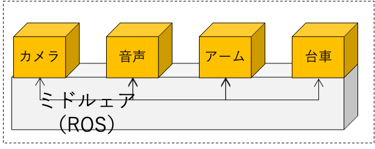
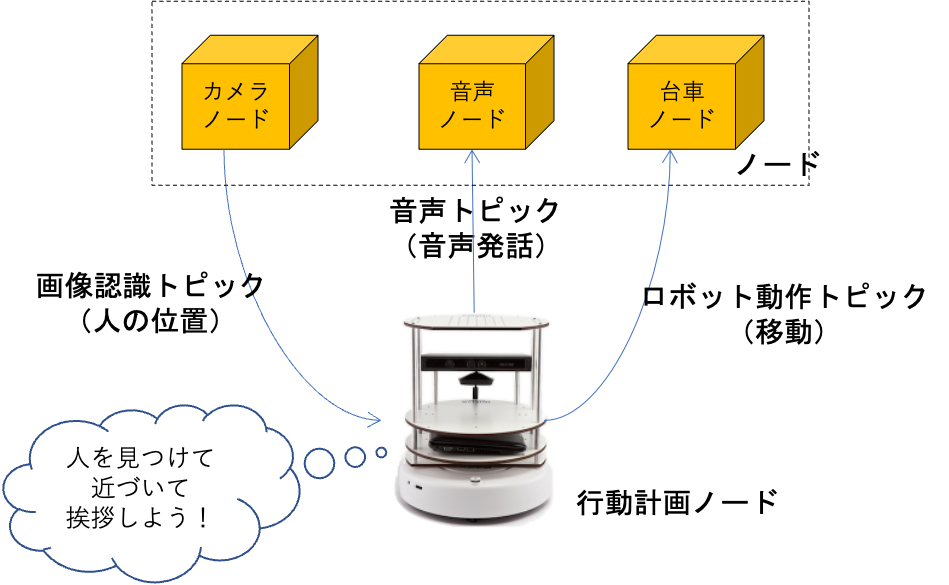
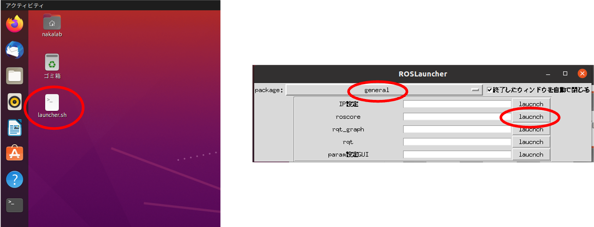
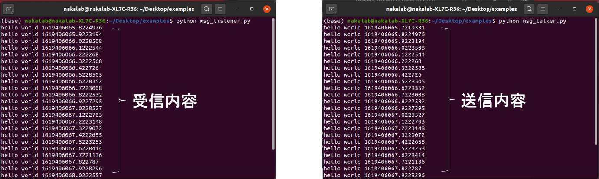
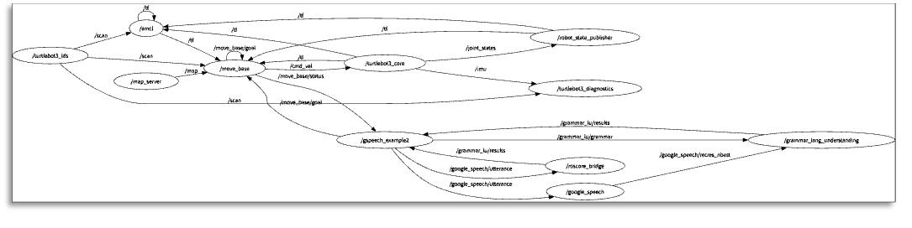
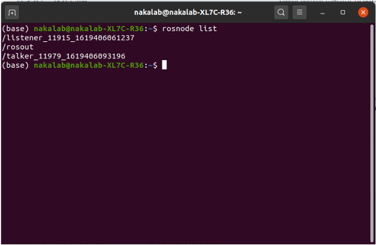
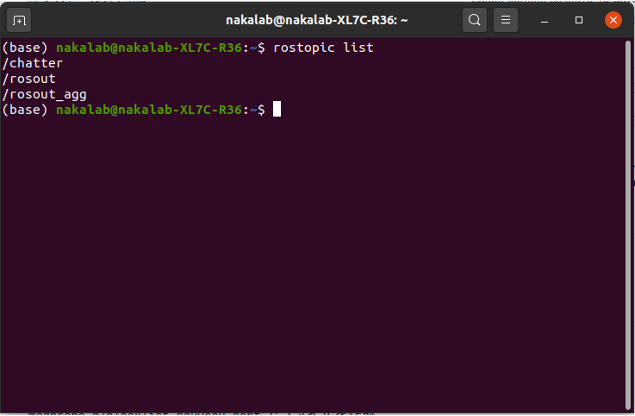
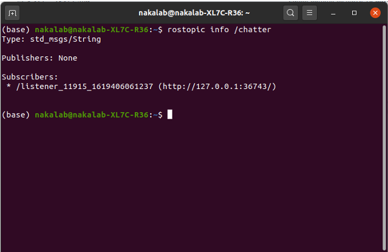
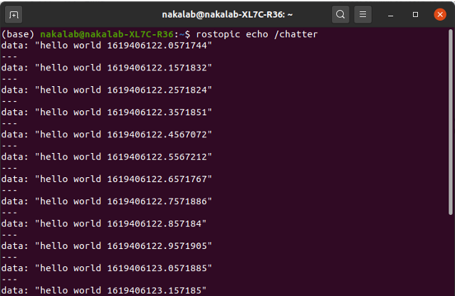
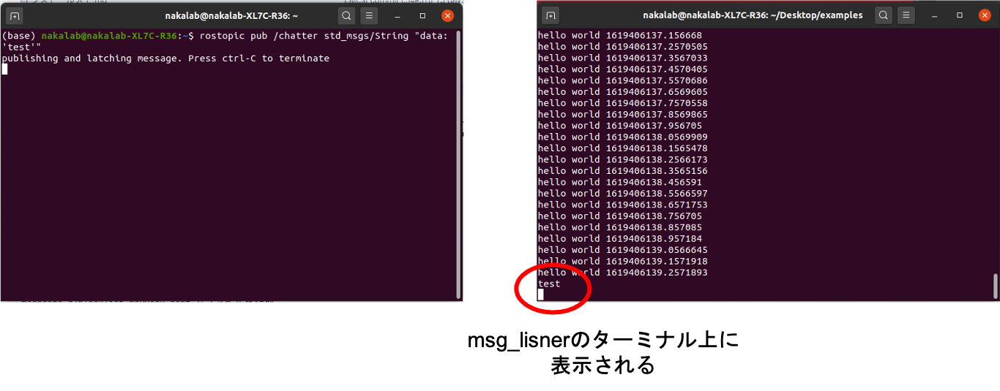

# 基本編

## ROSとは？

- Willow Garageが開発したロボット用OS，現在はOpen Roboticsに引き継がれている
- Ubuntuで動作しロボット開発に必要な様々な機能（ミドルウェア）を提供
- ミドルウェアとは？
  - OSとアプリケーションの中間に位置し，様々なソフトが利用可能な標準化されたインタフェース（通信機能）を提供
  - 標準化された仕様で作ることでソフトウェア同士が通信できる仕組み
- ROS（ミドルウェア）の利点
  - 独立して開発が可能
  - 一部が壊れてもシステム全体は停止しない
  - 他の人が作ったものを**再利用**できる



## ROSによるプログラム間の通信

- 様々なソフトウェアが様々な情報を送受信して動作
  - ソフトウェア＝node
  - 情報＝topic
  - 送信=Publish
  - 受信=Subscribe
  - nodeやtopicの管理を行うソフトウェア＝roscore
- roscoreが様々な情報を管理
  - どんなノードがあるか
  - どのノードがどのトピックを発行(Publish)しているか
  - どのノードがどのトピックを要求(Subscribe)しているか



## ROSにおける3種類のデータの送受信

1. Publisher・Subscriber
   - 一方的な送信と受信
   - ROSの最も基本的な送受信方法
   - 例：アームの関節角の送受信


2. Service

3. Action
   - データを送ったら，応答があるまで待機（さらにアクションは途中経過を取得可能）
   - 例：アームの移動命令の送受信等


## [演習] 送受信してみよう

- roscoreの起動
  - デスクトップのlauncher.shをダブルクリック
  - Generalのroscoreのlaunchボタンを押す




- サンプルプログラムの実行

  - サンプルプログラムをダウンロード（右クリックメニューから保存する）

    - 受信側：[msg_listener.py](https://github.com/naka-lab/ros_practice/raw/main/script/msg_listener.py)
    - 送信側：[msg_talker.py](https://github.com/naka-lab/ros_practice/raw/main/script/msg_talker.py)

  - プログラムの実行

    ```
    python msg_listener.py
    python msg_talker.py
    ```




## ROSの便利なコマンドたち

- ROSでは，プログラム（node）間が情報をやり取りしてシステム全体として動作
- やり取りする情報を見ることでデバッグが可能
  - 内部でどのような変数がやりとりしてるか確認
  - 内部の情報を読み取り，所望の値になってるか検証
  - 特定の情報を送信し，所望の動作をするかを検証



- コマンドなんて覚えられない・・・
  - **Tabを連打** しましょう
  - ROSは**Tab補完**機能が優秀なので一部入力してTabを押すと必要な情報を補完してくれます


## [演習] コマンドを利用してみましょう

- どんなnodeが実行されているか：`rosnode list` (Tab補完を使いましょう)
  
- どんなトピックがやりとりされているか：`rostopic list` (Tab補完を使いましょう)
  

- トピックの型は何か：`rostopic info /chatter` (Tab補完を使いましょう)
  

- そのトピックではどんなメッセージがやり取りされてるか：`rostopic echo /chatter` (Tab補完を使いましょう)
  

- メッセージの送信：`rostopic pub  /chatter  std_msgs/String  “data: ’test’”`  (Tabを**連打**しましょう)

  - (`rostopic pub  (トピック名)  (トピックの型)  (データ)`)
    

    
