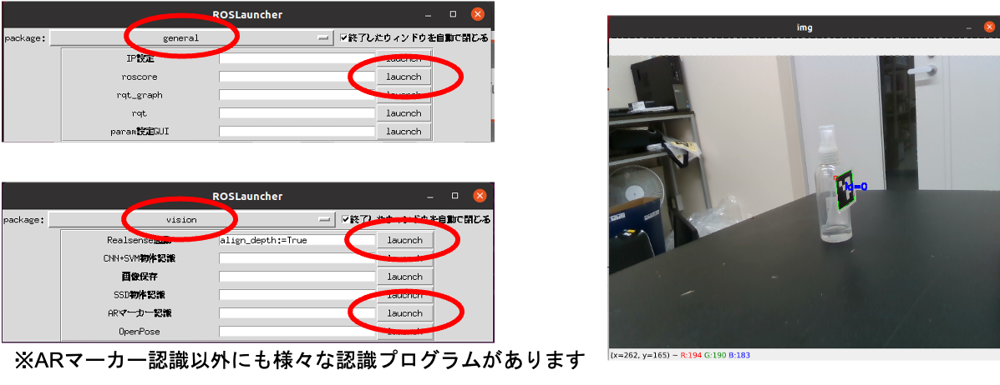
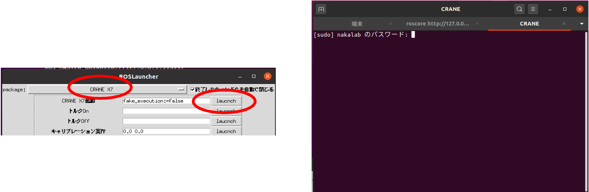
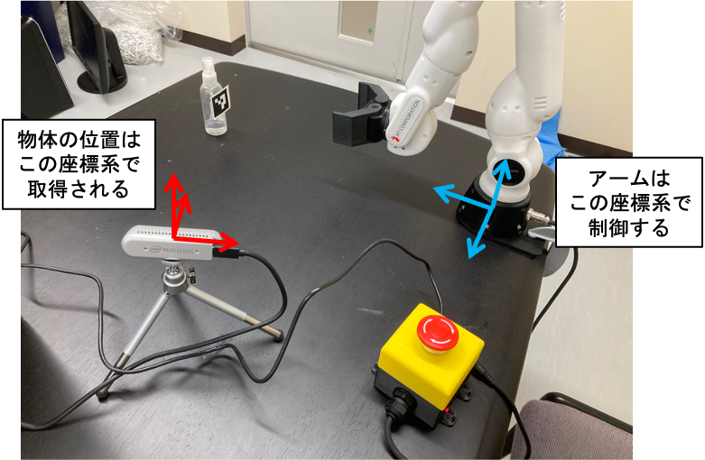
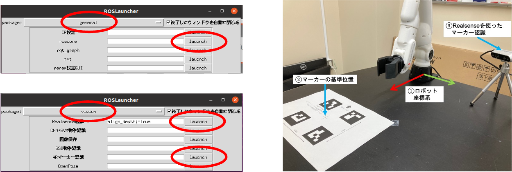
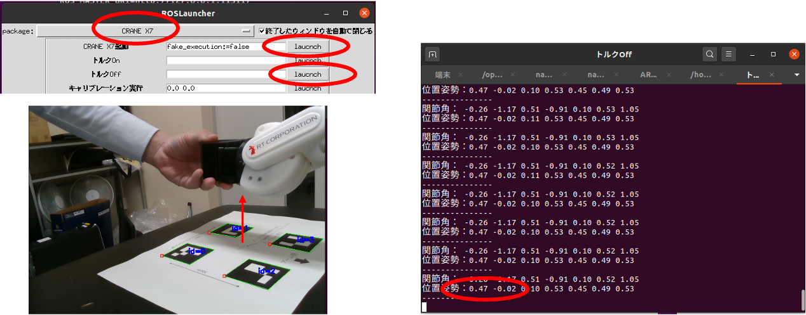
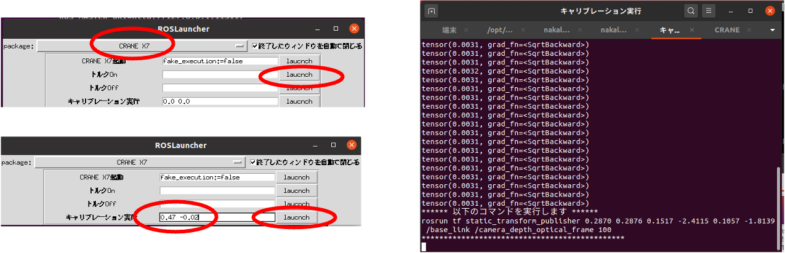

# 物体認識・マニピュレーション編

## [演習] ARマーカー認識の利用

- launcherから`general`の`roscore`の実行（すでに立ち上げてあれば不要）
- launcherから`Vision`の`Realsense起動`を実行
- launcherから`Vision`の`ARマーカー認識`を実行
- [受信プログラム](https://github.com/naka-lab/ros_practice/raw/main/script/object_info_getter.py)をダウロードして実行：`python object_info_getter.py`

## [演習] ロボットアームの利用

- launcherから`general`の`roscore`の実行（すでに立ち上げてあれば不要）
- launcherから`CRANE X7`の`CRANE X7起動`を実行
- パスワードを要求されるので入力
- [位置指定移動プログラム](https://github.com/naka-lab/ros_practice/raw/main/script/cranex7_move_to_position.py)をダウンロードして実行：`python cranex7_move_to_position.py`

## カメラとアームの位置合わせ（キャリブレーション）

- カメラに写ったものを掴むためには，物体位置をカメラ座標系からアーム座標系へと変換が必要
- ARマーカーを使って変換行列を推定することで座標系を変換: 

## [演習] カメラとアームのキャリブレーション

- マーカー認識の起動
  - launcherから`general`の`roscore`の実行（実行済みなら不要）
  - launcherから`Vision`の`Realsense起動`を実行（実行済みなら不要）
  - launcherから`Vision`の`ARマーカー認識`を実行（実行済みなら不要）
  - キャリブレーション用のマーカーをロボットの前に右下図のように配置

- マーカーのアーム座標系での位置を計測
  - launcherから`general`の`roscore`の実行（実行済みなら不要）
  - launcherから`CRANE X7`の`CRANE X7起動`を実行（実行済みなら不要）
  - パスワードを要求されるので入力（実行済みなら不要）
  - （**アームが脱力するので注意！**)launcherから`CRANE X7`の`トルクOFF`を実行
  - 左下図のようにハンドの付け根をマーカーの基準位置の上へ移動
  - コンソールに表示された値（ハンドの付け根のxy座標）を記録

- キャリブーションの実行
  - アームをカメラの範囲外に移動する
  - （**アームが急に動くことがあるので注意！**)launcherから`CRANE X7`の`トルクON`を実行
  - 記録したxy座標をlauncherの`キャリブレーション実行`のテキストボックスに入力し実行
    - これでカメラで計測したARマーカーの位置を，ロボット基準の座標系から見た位置（入力したハンドの位置から計算）へ変換するための変換行列（厳密にはTF）が計算されpublishされる

## [演習] カメラに写った物体の把持

- ARマーカー認識，キャリブレーションプログラム，CRANE X7が実行されていることを確認する
- ID:0のARマーカーをカメラに映るように下図のように配置
- [プログラム](https://github.com/naka-lab/ros_practice/raw/main/script/cranex7_grasp_object.py)ををダウンロードして実行：`python cranex7_grasp_object.py`