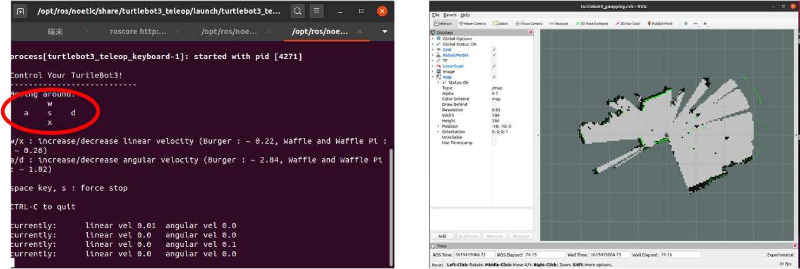

# 音声認識・ナビゲーション編

## [演習] 音声認識の利用

- launcherから`general`の`roscore`の実行（すでに立ち上げてあれば不要）
- launcherから`speech`の`Google音声認識`を実行
- ターミナルに表示されたURLへ**Google Chrome**でアクセス
  
- **Google Chrome**で開いたページの「音声認識・合成開始」ボタンを押す
  - PCのマイクに向かって話すと認識結果が表示される
  - 発話のエディットボックスに文字を入力し，発話ボタンを押すとPCから音声が流れる
    
- [言語理解・対話プログラム](https://github.com/naka-lab/ros_practice/raw/main/script/example_grammar.py)をダウンロードして実行：`python example_grammar.py`
- このプログラムを書き換えて面白い音声対話ができるようにしてみましょう

## [演習] ロボット内部のPCを準備

- launcherから`general`の`roscore`の実行（すでに立ち上げてあれば不要）
- ロボット内部PCにSSH接続（内部PCを遠隔で操作するためのコマンド）：`ssh pi@192.168.1.***`
  - `pi`: 内部PCのユーザ名（パスワードは`turtlebot`）
  - `192.168.1.***`: 内部PCのIPアドレス（ロボットによって***部分が異なるので注意）
  - SSHはUbuntuを利用する時に非常に便利なので使えるようになっておくといいです（lab infoにも使い方を記載しています）
  
- SSH接続したターミナルでロボット内部PCの時刻合わせ：`sudo –E ~/set_time.sh`
  
- SSH接続したターミナルでロボットノードを起動： `roslaunch turtlebot3_bringup turtlebot3_robot.launch` (**Tab補完**を利用する）
  
- ノートPCでロボット関連ノードが起動していることを確認：`rosnode list`
  

## [演習] 地図の作成

ロボットが移動するためにロボット自身が環境中のどこにいるのか（自己位置）を知るよう必要がある．まず，自己位置を推定するための地図を作成する．

- launcerから`Turtlebot3`の`地図生成`を実行
- lancherから`Turtlebot3`の`キーボード入力`を実行  
　　
- **ターミナル上** でw/a/s/d/xを入力しロボットを動かして地図を生成
  - 左図がロボットをキー入力で操作するプログラム，右図が作成されている地図．移動していくと徐々に地図が作成される．
    

## [演習] 地図の保存と確認

- lancherから`Turtlebot3`の`地図保存`を実行（Homeディレクトリにmapというファイル名で保存される）
  
- lancherから`Turtlebot3`の`地図表示`を実行
- 地図画像上をドラッグすると，その位置と角度を確認できる
  

## [演習] 地図を利用したロボットの自律移動

- lancherから`Turtlebot3`の`ナビゲーション`を実行（デフォルトではHomeディレクトリのmapが地図として利用される）
  
- Rvizから移動命令を送信
  - ロボットは自身の現在位置が分かってないので，`2D Pose Esitmate`で地図上の現在位置を設定
  - `2D Navi Goal`で目的地を指定すると目的地まで自律的に移動
    
- [移動命令送信プログラム](https://github.com/naka-lab/ros_practice/raw/main/script/example_grammar.py)をダウンロードして，目的地の座標を書き換え実行してみましょう：`python navigation.py `

## 課題

- 音声認識とロボットの移動を組み合わせて何か作ってみましょう
