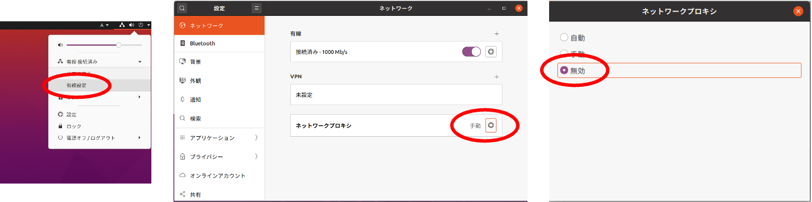
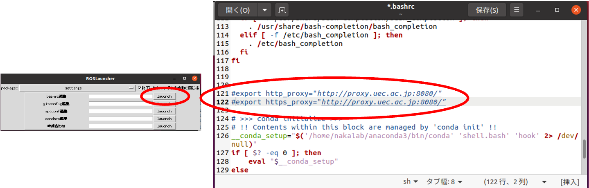
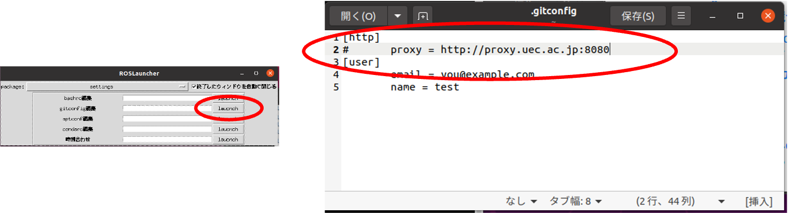
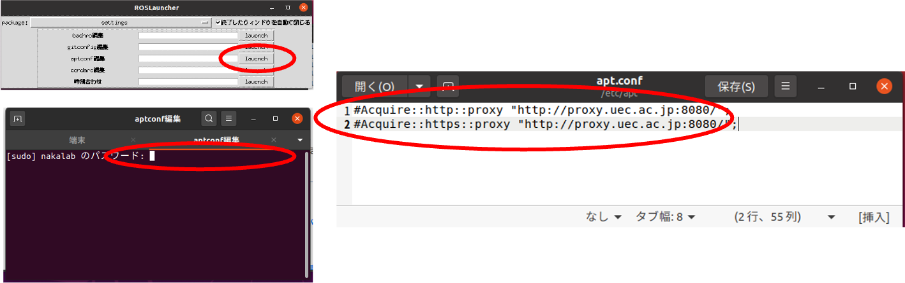
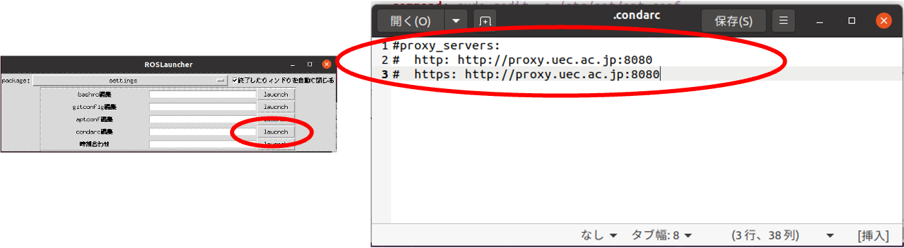

# Proxy設定に関して

- 自宅からUbuntuでネットワークに接続するにはProxyの設定（proxy.uec.ac.jp）を解除する必要があります
- Proxyは以下の場所に設定されています
  - システム全体
  - コマンド関連（bashrc）
  - Git（gitconfig）
  - パッケージインストーラ（aptconf）
  - Anaconda（condarc）
- 逆に大学でネットワーク接続するためには，設定を元に戻してください

## システム全体のプロキシの無効化

- 右上の設定メニューから`有線設定`を開く
- `ネットワークプロキシ`の設定を開く
- `無効`を選択
    

## コマンド関連のプロキシ無効化（bashrc）

- launcher.shを起動
- `setting`の`bashrc編集`を起動
- 該当箇所を`#`でコメントアウトして保存して閉じる
- 立ち上げてるターミナルを閉じて，再度起動する（または`source ~/.bashrc`を実行する）
  

## Gitのプロキシ無効化（gitconfig）

- launcher.shを起動
- `setting`の`gitconfig編集`を起動
- 該当箇所を`#`でコメントアウトして保存して閉じる
  

## パッケージインストーラのプロキシ無効化（aptconf）

- launcher.shを起動
- `setting`の`aptconf編集`を起動
- **パスワードを入力**
- 該当箇所を`#`でコメントアウトして保存して閉じる
  

## Anacondaのプロキシ無効化（condarc）

- launcher.shを起動
- `setting`の`condarc編集`を起動
- 該当箇所を`#`でコメントアウトして保存して閉じる
  