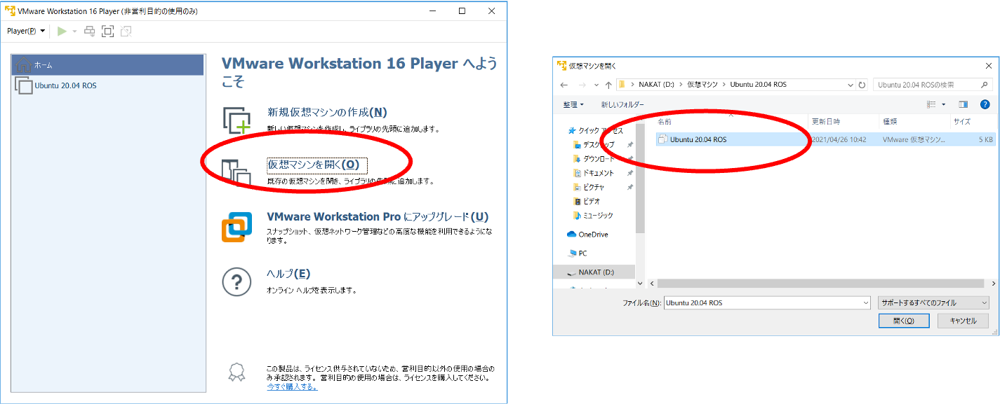
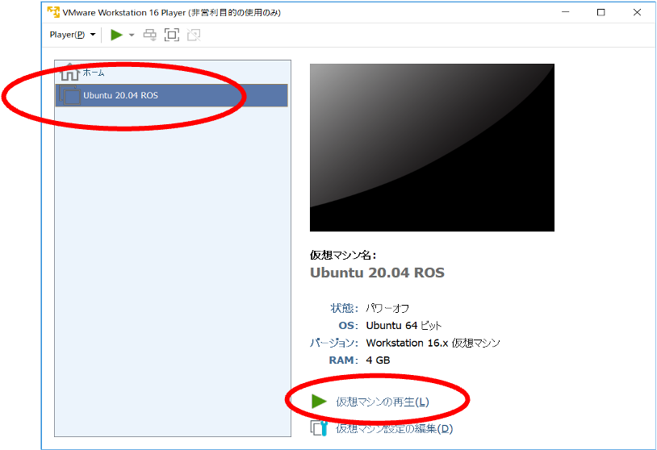
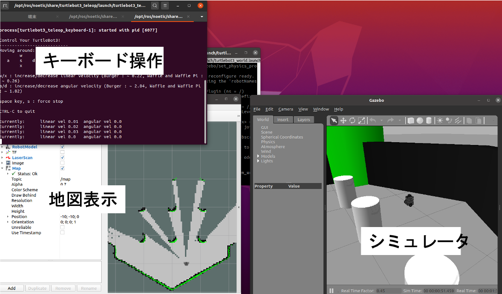
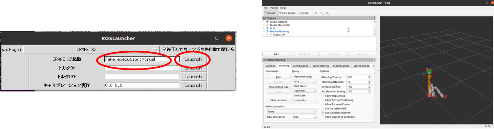
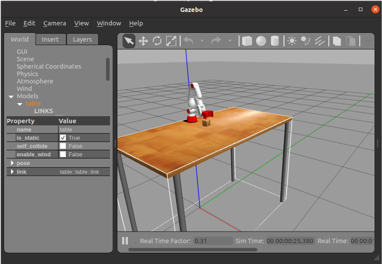
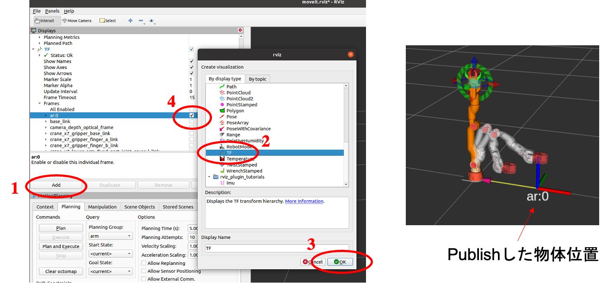
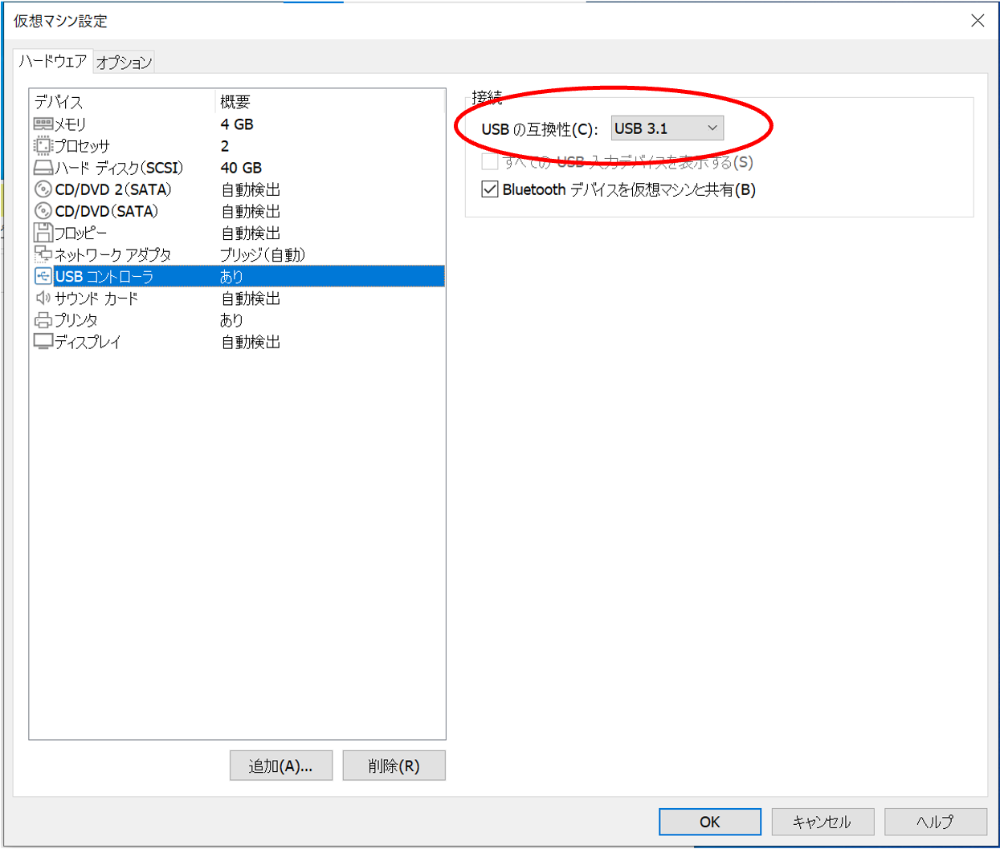
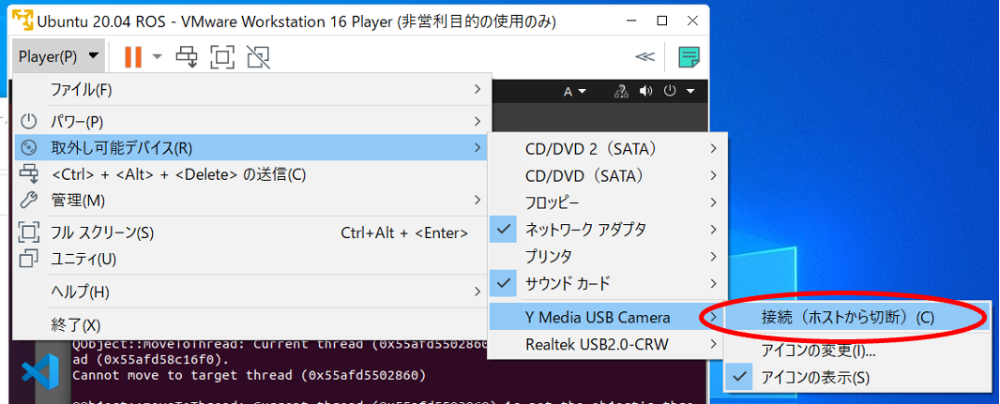
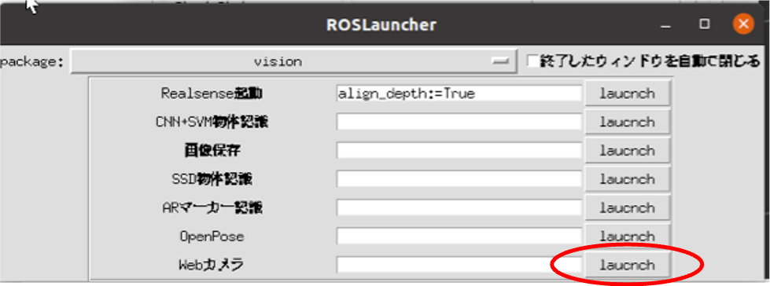

# シミュレーション編

仮想マシンでUbuntuとROSを動かすことで，実機がなくても，自身のWindows PCでもROSのロボットシミュレータを利用することができます．


## 仮想マシンのセットアップと実行

- ROS講習会で配布したフォルダを自身のPCへコピー
- フォルダ内のVMware-player-16.1.1-17801498.exeでVMWarePlayerをインストール
  - VMWarePlayer: 仮想マシンを実行するソフト
- インストールしたVMWarePlayerを実行し，自身のPCにコピーした 仮想マシンイメージ（Ubuntu 20.04 ROS）をVMWarePlayerに追加
  
- 追加した仮想マシン（Ubuntu 20.04 ROS ）を実行
  
- Ubuntuが起動するのでログインする


## シミュレータの利用

- シミュレータを使うことで，実機がなくても簡単にプログラムの動作検証ができます
- シミュレータを利用して，各自ROSに関して自習してください
- ROSにおけるシミュレータの種類
  - Rviz
    - ロボットの様々な情報の**可視化ツール**
    - ロボットの姿勢や位置等を確認できる
    - 複雑なことはできないが軽い
  - Gazebo
    - ロボットの本格的なシミュレータ
    - 物理演算，各種センサなどをシミュレーションできる
    - 複雑なこともできるが重い


## Turtlebot3のGazeboシミュレータ

- インストール

  ```
  cd ~/catkin_ws/src/
  git clone -b noetic-devel https://github.com/ROBOTIS-GIT/turtlebot3_simulations.git
  cd ~/catkin_ws
  catkin_make
  ```

- 実行（1行目のコマンドはvmwareでgazeboを使うためのおまじない）

  ```
  export SVGA_VGPU10=0
  roslaunch turtlebot3_gazebo turtlebot3_empty_world.launch
  ```

- 起動したらlancherから起動した地図生成・地図保存・ナビゲーションや，書き換えた[移動命令送信プログラム](https://github.com/naka-lab/ros_practice/raw/main/script/navigation.py)を利用可能
  


## Crane X7のrvizシミュレータ

- 実機を接続してない状態で，lancherから`Crane X7`の`CRANE X7起動`のテキストボックを`fake_execution:=true`として実行
- Rviz上のCrane X7を[プログラム](https://github.com/naka-lab/ros_practice/raw/main/script/cranex7_move_to_position.py)から操作可能
  


## Crane X7のGazeboシミュレータ

- 実行（1行目のコマンドはvmwareでgazeboを使うためのおまじない）
  ```
  export SVGA_VGPU10=0
  roslaunch crane_x7_gazebo crane_x7_with_table.launch
  ```
- Gazebo上のCrane X7を[プログラム](https://github.com/naka-lab/ros_practice/raw/main/script/cranex7_move_to_position.py)から操作可能  
  


## 物体認識

カメラがなくても，認識した物体の情報をPublishすることで物体認識結果に応じた動作も検証可能

- 仮想的なカメラの位置を設定
  ```
  rosrun tf static_transform_publisher 0 0 0 0 0 0 /base_link /camera_depth_optical_frame 100
  ```
  
- [物体情報送信プログラム](https://github.com/naka-lab/ros_practice/raw/main/script/object_dummy_sender.py)を実行
  - 送信する情報を変更したい場合は以下の部分を書き換える
    ```
    label = 0           # 物体（ARマーカー）のID
    pos = (0.4, 0, 0)   # 物体のz, y, z座標
    topic_name = "/ar_marker_rec/object_info"    # トピック名
    ```
  
- この状態でCraneX7のシミュレータを立ち上げ，[物体把持プログラム](https://github.com/naka-lab/ros_practice/raw/main/script/cranex7_grasp_object.py)を実行すると，物体が目の前にあるときと同じ動作が再現できる

- 送信した物体の情報はrvizで確認可能
  


## Webカメラで物体認識

- 仮想マシン起動前に仮想マシン設定の「USBの互換性」を`USB3.1`にする
  
- 仮想マシンを起動して，Webカメラを仮想マシンへ接続（カメラの名称は環境によって異なります）
  
- lancherの`vision`から`Webカメラ`を起動  
  
- この状態で`ARマーカー認識`を起動すれば，Webカメラを利用したARマーカーの認識が可能


## 音声認識

仮想マシンであっても，音声認識はそのまま利用可能です．[音声認識・ナビゲーション編](navigation.md)の「音声認識の利用」を参照してください．

## その他のシミュレータ

ここで紹介したもの以外にも様々なシミュレータが利用可能です．各自で探して色々試してみてください．

